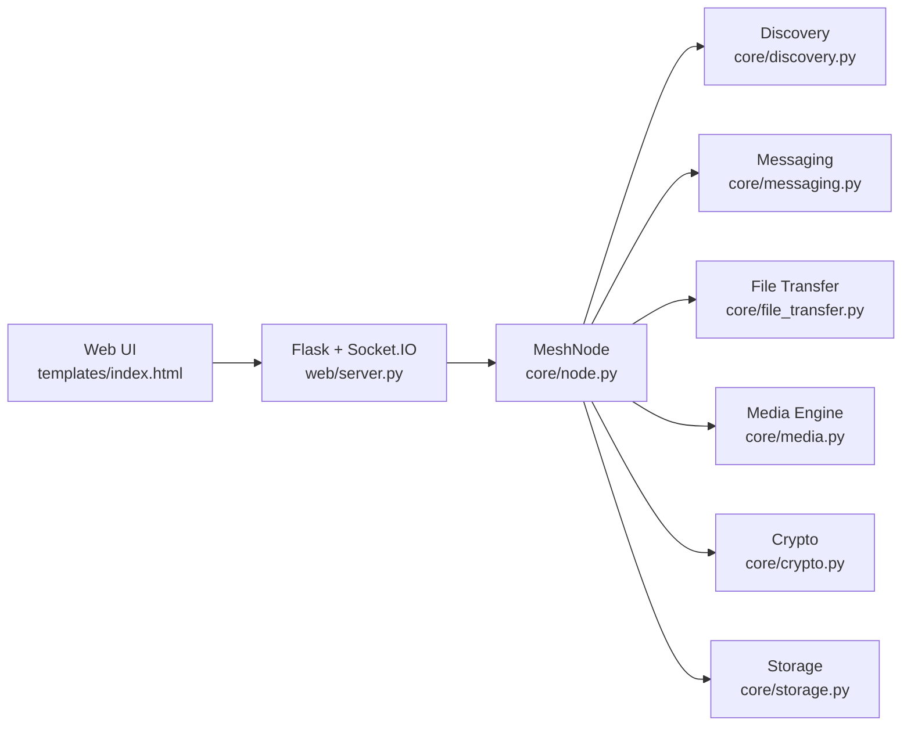

# Архитектура MeshLink (Hex.Team)

## 1. Высокий уровень обзора

## 2. Топология и маршрутизация

- Топология: LAN mesh.
- Обнаружение: UDP broadcast + multicast + static peers.
- Маршрутизация: контролируемое flooding с:
  - дедупликацией `msg_id`,
  - декрементом TTL,
  - отслеживанием пути ретрансляции,
  - fanout под пределами backpressure.

## 3. Модель надёжности

- Текстовые сообщения:
  - отслеживание доставки (`DELIVERY_ACK`),
  - повтор с экспоненциальным backoff,
  - постоянный outbox и replay.
- Файлы:
  - передача по частям,
  - проверка целостности SHA-256,
  - частичное возобновление с валидацией хэша смещения.

## 4. Медиа в реальном времени

- Сигнализация через Socket.IO / канал сообщений.
- Browser WebRTC для транспорта RTP.
- Живой QoS в UI: RTT, jitter, loss, bitrate (`getStats()` + EMA).

## 5. Модель безопасности

- Обмен ключами: X25519 (ECDH).
- Шифрование сообщений: AES-256-GCM.
- Целостность/аутентичность: подписи Ed25519.
- Внедрение доверия: seed pairing (политика только доверенных).
- Контроли злоупотреблений: rate-limit, autoban, blacklist.

## 6. Расширение группового чата

- Добавлен тип сообщения протокола `GROUP_TEXT`.
- Метаданные группы хранятся в `MeshNode.groups`.
- Групповой fanout отправка от отправителя доверенным членам.
- Групповые сообщения отображаются как чаты с ключом `group:<group_id>`.

